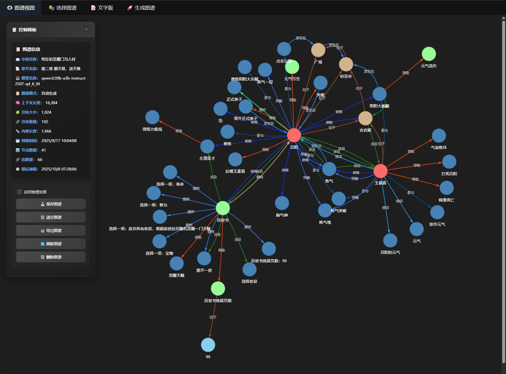
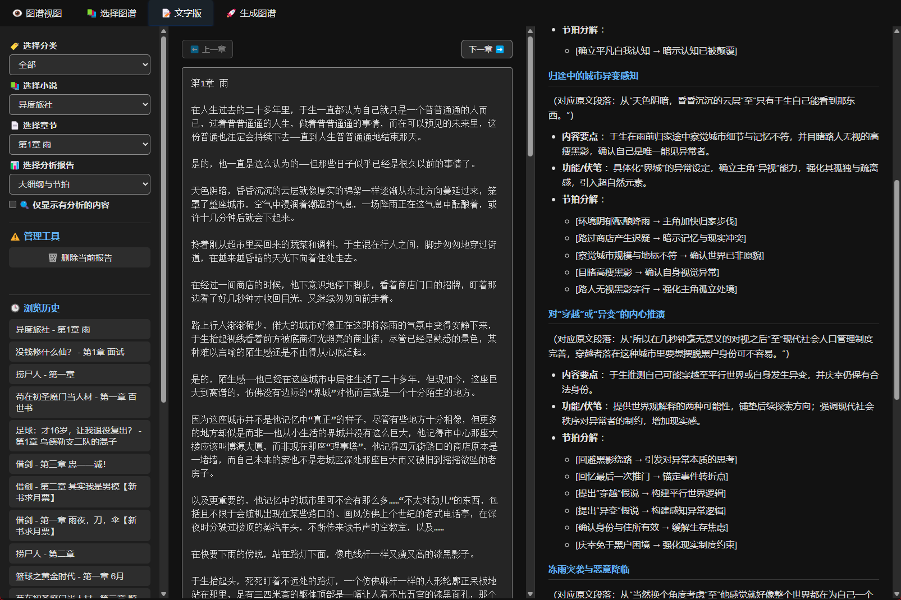
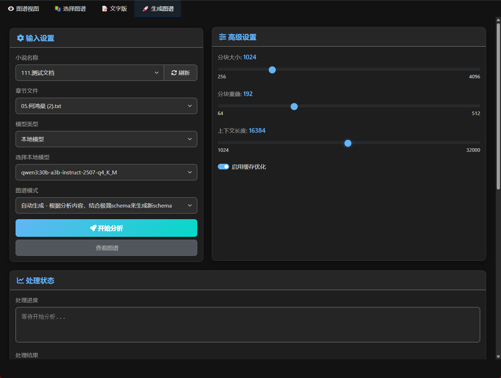

# AI小说写作学习工具

这是一个帮助热爱写作、想学习写作的个人提升小说创作能力的AI辅助工具。本工具旨在通过人工智能技术，为小说写作爱好者提供学习资源、创作灵感和写作指导。

## 功能特点
- 提供小说写作技巧和方法的学习资源
- 通过AI分析优秀小说案例，提取写作模式
- 辅助构思故事情节、人物设定和世界观构建
- 提供写作风格模仿和练习功能
- 支持多种小说类型的学习和创作

## 工具截图

## 使用方法
1. 克隆本仓库到本地
2. 安装必要的依赖环境
3. 运行主程序开始使用 (kg_interaction.py)

## 注意事项
- 本工具仅供个人学习使用，禁止用于任何商业目的
- 所有通过本工具生成的内容，其知识产权归原作者或相关权利人所有
- 使用本工具时，请遵守相关法律法规和道德规范

## 免责声明
本工具仅用于学习交流，不保证生成内容的质量和适用性。对于因使用本工具而产生的任何问题，作者不承担任何责任。

## 贡献
欢迎各位写作爱好者提出宝贵意见和建议，共同完善这个学习工具。

---
**非商业用途声明：** 本项目及所有相关资源仅供热爱写作、想学习写作的个人学习使用，禁止任何形式的商业用途。
